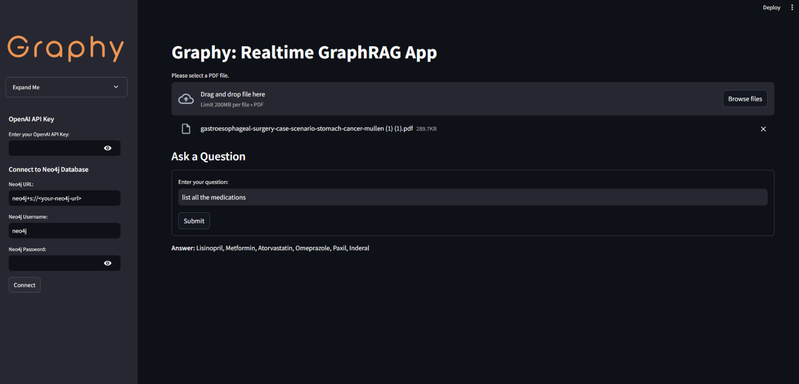

# Graphy





# **Graphy v1 - Real-Time GraphRAG Application**

Graphy v1 is an innovative **Graph Retrieval-Augmented Generation (GraphRAG)** application that combines the power of **OpenAI’s GPT models**, **Neo4j**, and **LangChain** to transform unstructured data from PDFs into structured knowledge graphs. This app allows users to seamlessly query the extracted information using natural language, making data interactions smooth, intuitive, and real-time. It’s designed to simplify the process of **knowledge extraction and querying** by leveraging **graph databases** and **NLP-driven chat interfaces**.

---

## **App Screenshot**

(Insert a relevant screenshot here to showcase the app interface)

---

## **Table of Contents**

1. [Overview](#overview)  
2. [Features](#features)  
3. [Demo](#demo)  
4. [Getting Started](#getting-started)  
5. [Prerequisites](#prerequisites)  
6. [Installation](#installation)  
7. [Usage](#usage)  
8. [Contributing](#contributing)  
9. [License](#license)  
10. [Contact](#contact)

---

## **Overview**

Graphy v1 is built to handle **PDF-based data extraction and visualization** using graph databases. Users can upload PDF documents, extract **entities and relationships**, and query the results in **natural language**. The application transforms natural language queries into **Cypher queries**, allowing for efficient interaction with the **Neo4j graph database**. This system enhances the way documents are processed and analyzed, offering **real-time responses** through an easy-to-use web interface.

The platform supports **extensible architecture** for future improvements and is ideal for those interested in **AI, NLP, graph databases, and real-time knowledge retrieval**.

---

## **Features**

- **Real-Time GraphRAG**: Extracts knowledge from uploaded PDFs and supports real-time queries over graph data.
- **Natural Language Interface**: Users can ask questions in plain English, and the system generates Cypher queries to return answers from the graph.
- **Modular and Configurable**: Users can input their own **OpenAI API credentials** and **Neo4j database configurations**, making the app customizable for different use cases.
- **Visualization (Coming Soon)**: Future releases will include graph visualization to display entities and relationships interactively.
- **Extensible Design**: The platform can handle multiple documents and is built to support **conversational AI features** in future versions.

---

## **Demo**

(Insert a clickable image or link to a demo video, if available)

---

## **Getting Started**

This section provides a step-by-step guide to set up the app on your local machine.

---

### **Prerequisites**

Before installing and running Graphy v1, ensure you have the following:

- **Python 3.10** or higher  
- **OpenAI API key** with access to GPT models (e.g., gpt-4o, text-ada-002)  
- A **Neo4j database instance** (can be local or cloud-based)  
- **Streamlit** (for running the web interface)

---

## **Installation**

1. **Clone the Repository**

   ```bash
   git clone https://github.com/yourusername/graphy-v1.git
   cd graphy-v1


[](https://youtu.be/odtGLUPXqfs)


*Click the image above to watch the demo video on YouTube.*

## Getting Started

### Prerequisites

- Python 3.10 or higher
- An OpenAI API key with access to GPT models (e.g., `gpt-4o` or `ada 002`)
- A Neo4j database instance (local or remote)
- [Streamlit](https://streamlit.io/)

### Installation

1. **Clone the Repository**

   ```bash
   git clone https://github.com/yourusername/graphy-v1.git
   cd graphy-v1
   ```

2. **Install Dependencies**

   Create a virtual environment (optional but recommended):

   ```bash
   python -m venv venv
   source venv/bin/activate  # On Windows, use `venv\Scripts\activate`
   ```

   Install the required packages:

   ```bash
   pip install -r requirements.txt
   ```

### Usage

1. **Set Up Credentials**

   - Place your OpenAI API key and Neo4j credentials in a `.env` file or enter them directly in the app's sidebar when running.

   Example `.env` file:

   ```env
   OPENAI_API_KEY=your-openai-api-key
   NEO4J_URL=neo4j+s://your-neo4j-url
   NEO4J_USERNAME=your-username
   NEO4J_PASSWORD=your-password
   ```

2. **Run the App**

   ```bash
   streamlit run app.py
   ```

3. **Interact with the App**

   - Upload a PDF file using the file uploader.
   - Once the document is processed, ask questions in the provided text input field.
   - View the generated Cypher query and the answer retrieved from the graph.


